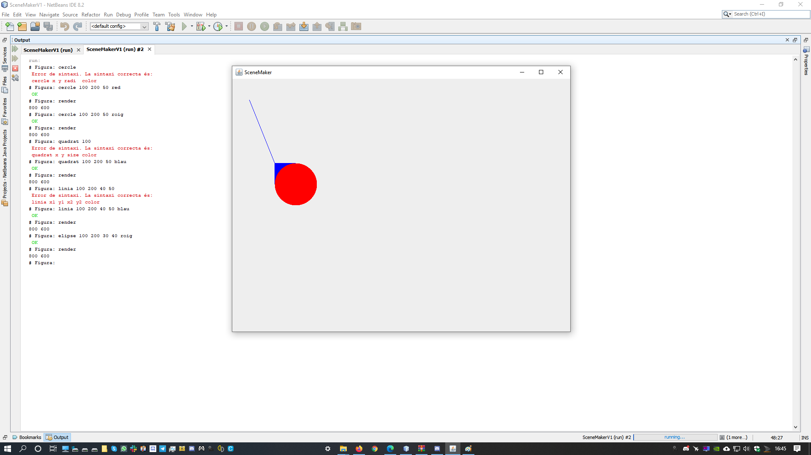
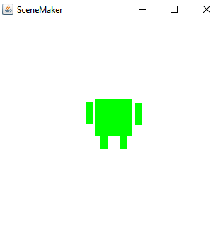
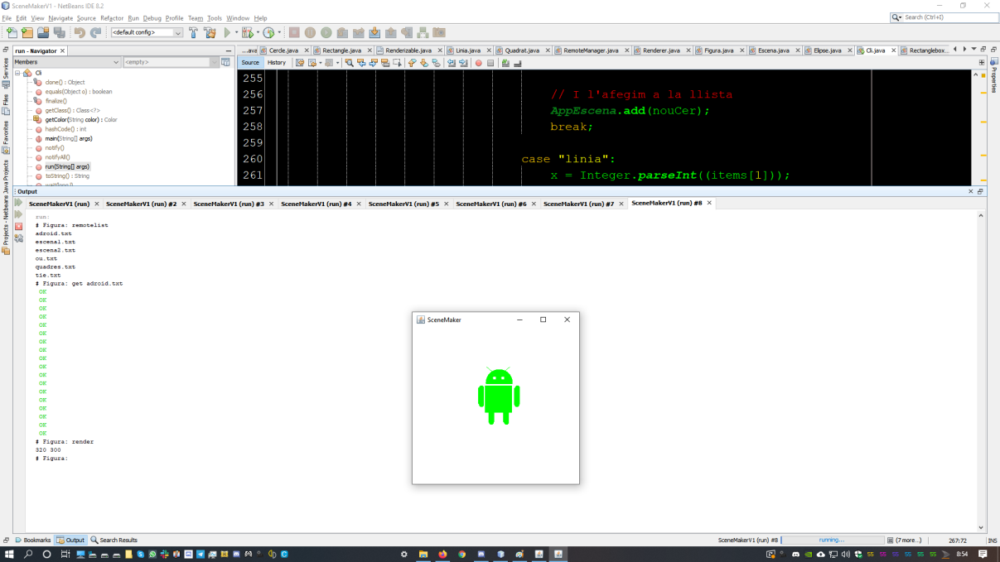

# scene-maker
Simple Java CLI Application to draw rectangles.

SceneMaker és una aplicació Java en línia d'ordres, que permet afegir figures de tipus rectangle, de forma interactiva, mostrar-les, descarregar imatges d'un servidor i dibuixar-les.

Aquesta aplicació s'utilitzarà al mòdul d'Entorns de Desenvolupament, com a base, per tal de treballar amb l'anàlisi i disseny orientat a objectes, ampliant la seua funcionalitat. Es treballarà des de la part d'anàlisi de nous requeriments fins la implementació d'aquestes funcionalitats, reforçant alguns aspectes de programació orientada a objectes.

## Continguts

En aquest repositori trobareu dues carpetes:

* **src**: Amb el codi font de l'aplicació de base.
* **doc**: Amb la documentació actual de l'aplicació, composta principalment de diagrames de casos d'ús i diagrames de classes.
* **enunciats**: Amb els enunciats dels exercicis.

## Ejercici (fitxers Rectangle.java(Eixemple), Linia.java, Quadrat.java, Cercle.java, Elipse.java)

### Rectangle.java 
- Possibilita d'afegir quadrats rectangles, amb els 2 costats diferents i el color indicat.La sintaxi serà la següent:
```
rectangle x y width height color
```


### Linia.java 
- Possibilita d'afegir Línies, entre dos punts donats. La sintaxi serà:

```
linia x1 y1 x2 y2 color
```

Per exemple:

```
# Figura: linia 100 150 150 170 negre
```

### Quadrat.java 

- Possibilita d'afegir quadrats, en una posició donada, i del costat i color indicat. La sintaxi serà la següent:

```
quadrat x1 y1 costats color
```

Per exemple:

```
# Figura: quadrat 100 100 150 150 verd
```

Dibuixarà un quadrat verd en la posició (100,100), i de costat 150.

### Cercle.java 
- Possibilita d'afegir Cercles en una posició donada, i de radi i colors concrets. La sintaxi serà:

```
cercle x y radi color
```

Per exemple:

```
# Figura: cercle 100 150 50 50 blau
```

Dibuixarà un cercle blau centrat en la posició (100,150), i de radi 50.


### Elipse.java 
- Possibilita d'afegir El·lipses, en una posició donada, i radis en x i y, aixó com el color concrets. La sintaxi serà:

```
elipse x y radi_X radi_Y color
```

Per exemple:

```
# Figura: elipse 100 150 50 70 negre
```

Dibuixarà una el·lipse centrada en la posició (100,150), i de radis 50 i 70.

## Ejercici (2na part) (Remotelist, list, render i mostrar adroid.txt de la llista remota).

Captura amb les primeres proves amb render i la finestra que genera.


Captura de render incomplet de adroid.txt (faltaba reparar métodes get del fitxer Cli).



Captura de render COMPLET de adroid.txt (faltaba reparar métodes get del fitxer Cli).


